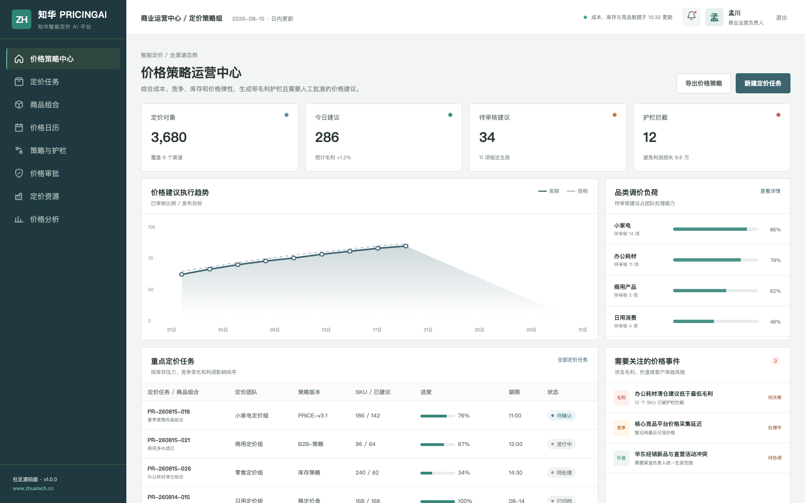
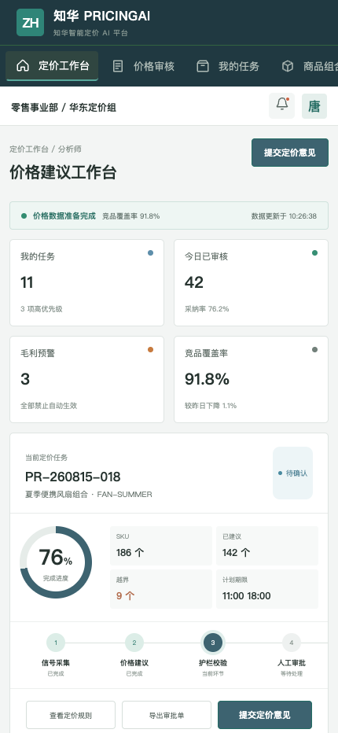

<div align="center">

# ZhuaTech PricingAI

### 知华智能定价 AI 平台

响应竞争与库存变化，但始终守住成本、毛利和人工审批边界。

[知华科技官网](https://www.zhuatech.cn/) · 上海如静知华信息科技有限公司

</div>

## 产品定位

ZhuaTech PricingAI 是面向零售、商贸和制造企业的智能定价社区源码项目。平台连接成本、返利、库存、竞品和价格弹性，生成带理由、受护栏约束且需要审批的价格建议，而不是让模型直接改价。



管理端用于观察定价对象、预计毛利、护栏拦截、品类负荷与重大价盘冲突。



分析师端提供建议价、最低价、竞争位置、库存压力、调整依据和审核反馈。

## 功能清单

- 商品、渠道、区域与客户价盘管理
- 成本、当前价、竞品中位价、库存覆盖和价格弹性组合计算
- `RAISE / LOWER / HOLD` 调价建议及变化率、预计毛利率
- 最低毛利硬护栏和大幅调价二级审批
- 定价任务、价格日历、版本审批和生效跟踪
- 管理端、响应式 H5、JWT、MySQL、Flyway 和 Docker Compose

`POST /api/ai/pricing/recommend` 提供不依赖外部 API Key 的参考定价策略。推荐结果始终返回 `approvalRequired=true`，避免把演示算法误当作自动发布系统。

## 工程栈

| 组成 | 技术 |
| --- | --- |
| 前端 | Vue 3、Pinia、Vue Router、Axios、Vite |
| 后端 | Java 21、Spring Boot 4、Spring Security、JPA |
| 数据 | MySQL 8、Flyway；H2 自动化测试 |
| 包名 | `cn.zhuatech.pricingai` |
| 部署 | Docker Compose、Nginx、CI |

## 快速体验

```bash
cd frontend
npm install
npm run dev:demo
```

访问 `http://localhost:5173`。管理端 `planner / Demo@2026`，分析师端 `operator / Demo@2026`。接口、架构和部署说明位于 [docs](docs/)；演示价格、成本、库存和人员均为虚构数据。

## 许可与联系

本工程仅限个人学习、研究和非商业技术交流，**不得商用**。企业内部使用、生产部署、SaaS、项目交付、收费咨询、品牌替换或二次销售，必须取得上海如静知华信息科技有限公司书面授权，法律条款以 [LICENSE](LICENSE) 为准。

智能定价、价格中台、渠道价盘、ERP/POS 集成和深度定制，可访问[知华科技官网](https://www.zhuatech.cn/)或扫码咨询：

| 定价方案咨询 | 商业授权与定制 |
| --- | --- |
|  |  |

SEO：智能定价、AI 定价、价格优化、动态定价、价格中台、Java 定价系统源码、知华科技。
